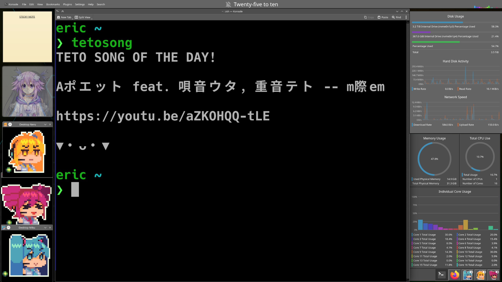

# **Kasane Teto in Your Terminal!**
## **Find songs nobody knows exist!** 
A small wrapper and custom list for fortune/misfortune that picks a random Teto song of the day from any of over 16,000 original, finished songs on VocaDB.

Now with optional Teto speaking in your terminal via ffplay! Just SV2, for now.

...despite the whole list being Utau songs at the moment (ᵕ•_•)



## **Dependencies**

### install.sh and tetosong
fortune/fortune-mod or misfortune 
ffmpeg -optional for speaking Teto


### makefortune.sh
fortune/fortune-mod (for strfile)
jq

## *Install and Run*

Install the tetosong command with:

```bash
bash <(curl -s https://raw.githubusercontent.com/eric5949/TetoSongOfTheDay/refs/heads/main/installer.sh)
```
once installed, make sure you add ~/.local/bin to your $PATH if it is not already there.

You can get your Teto song of the day by running: 
```bash
tetosong
```

Your original fortune command will remain untouched, tetosong just tells it to use a custom directory.
